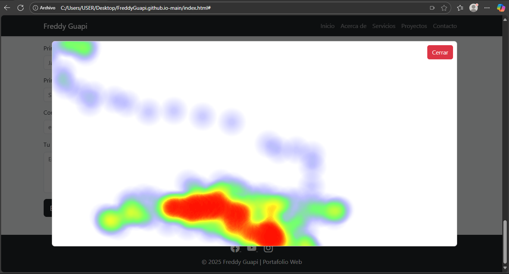

# Portafolio Web - Freddy Guapi

Este es un portafolio personal desarrollado por Freddy Guapi, diseñado para presentar habilidades, proyectos y servicios como desarrollador Full Stack, desarrollador móvil y diseñador web.

## ✨ Características principales

- Diseño limpio y moderno utilizando **Bootstrap 5**.
- Completamente **responsivo** (adaptado a móviles, tabletas y escritorio).
- Navegación animada con **AOS (Animate On Scroll)**.
- Secciones claras:
  - Inicio
  - Acerca de
  - Servicios
  - Proyectos
  - Contacto
- Iconos sociales con **Bootstrap Icons** (Facebook, YouTube, Instagram).

## ♿ Accesibilidad e Inclusión

Se realizaron los siguientes ajustes:

- Uso de `aria-label` en iconos sociales para lectores de pantalla.
- Contraste adecuado de colores para asegurar la legibilidad.
- Formulario accesible con etiquetas `<label>` y campos obligatorios (`required`).
- Navegación por teclado mediante Bootstrap.
- Diseño responsivo que adapta los contenidos para usuarios en diferentes dispositivos (evitando desplazamiento horizontal).

## 🔗 Enlaces

- 🔴 **GitHub Pages:** [https://freddyguapi.github.io/](https://freddyguapi.github.io/)
- 🎨 **Diseño en Figma:** [https://www.figma.com/design/jBzcVfxeAnoUp6n5e0vEgx/Untitled--Copy-?node-id=31-27&t=BhzgH5vdK6GXcxEc-0](https://www.figma.com/design/jBzcVfxeAnoUp6n5e0vEgx/Untitled--Copy-?node-id=31-27&t=BhzgH5vdK6GXcxEc-0)

## 📂 Estructura de Archivos

- `index.html`: página principal del portafolio.
- `styles.css`: estilos personalizados.
- `README.md`: este archivo.

# 🔍 Seguimiento Visual con Mapa de Calor

Este proyecto implementa un sistema de seguimiento ocular que detecta las zonas más observadas por el usuario en una página web, utilizando **WebGazer.js** para capturar la mirada y **Heatmap.js** para visualizar los datos en forma de mapa de calor.

---

## 🚀 ¿Cómo ejecutarlo?

1. Clona o descarga este repositorio.
2. Abre el archivo `index.html` en tu navegador preferido.
3. Otorga permisos para usar la cámara cuando lo solicite.
4. Navega por la página normalmente.
5. Pulsa el botón **“Detener seguimiento”** para ver el mapa de calor generado.
6. Se mostrará el mapa en un **popup**.

---

## 🛠️ Librerías utilizadas

- [📦 WebGazer.js](https://webgazer.cs.brown.edu/) – Seguimiento de mirada en tiempo real.
- [📦 Heatmap.js](https://www.patrick-wied.at/static/heatmapjs/) – Visualización del mapa de calor.
- HTML5, CSS3 y JavaScript puro.

---

## 🖼️ Captura de pantalla

Aquí se muestra una vista del mapa de calor generado:

---

Desarrollado por Freddy Guapi.
